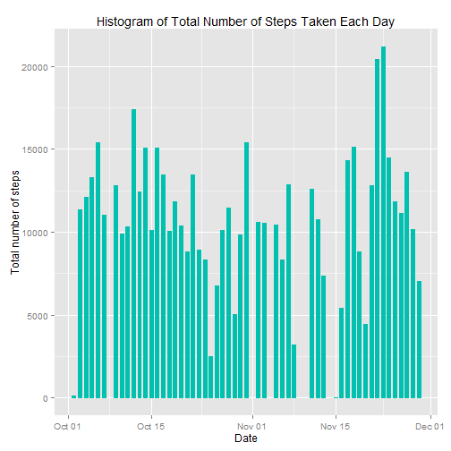
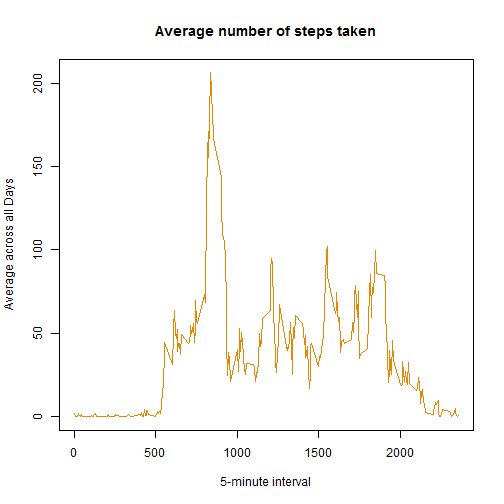
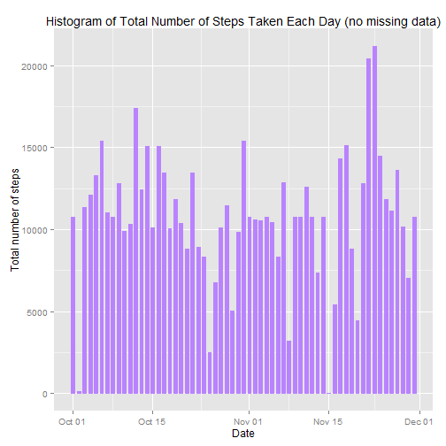

Reproducible Research: Peer Assessment 1
========================================================

This assignment will be described in multiple parts.It will write a report that answers the questions detailed below:

+ What is mean total number of steps taken per day?
+ What is the average daily activity pattern?
+ Imputing missing values
+ Are there differences in activity patterns between weekdays and weekends?

Assignment
----------

### Loading and preprocessing the data


```r
echo = TRUE  # Always make code visible
options(scipen = 1)  # Turn off scientific notations for numbers
```

#### Reformat and remove NA values


```r
library(lattice)
library(ggplot2)
```

```
## Warning: package 'ggplot2' was built under R version 3.1.3
```

```r
activity.data <- read.csv("activity.csv", colClasses = c("numeric", "character", 
    "numeric"))
activity.data$date <- as.Date(activity.data$date, "%Y-%m-%d")
head(activity.data)
```

```
##   steps       date interval
## 1    NA 2012-10-01        0
## 2    NA 2012-10-01        5
## 3    NA 2012-10-01       10
## 4    NA 2012-10-01       15
## 5    NA 2012-10-01       20
## 6    NA 2012-10-01       25
```

```r
names(activity.data)
```

```
## [1] "steps"    "date"     "interval"
```

```r
activity.data.noNA <- na.omit(activity.data)
head(activity.data.noNA)
```

```
##     steps       date interval
## 289     0 2012-10-02        0
## 290     0 2012-10-02        5
## 291     0 2012-10-02       10
## 292     0 2012-10-02       15
## 293     0 2012-10-02       20
## 294     0 2012-10-02       25
```

### What is mean total number of steps taken per day?

#### 1. Total number of steps taken per day


```r
Total.Steps.per.Day <- aggregate(steps ~ date, data = activity.data.noNA, sum)
Total.Steps.per.Day
```

```
##          date steps
## 1  2012-10-02   126
## 2  2012-10-03 11352
## 3  2012-10-04 12116
## 4  2012-10-05 13294
## 5  2012-10-06 15420
## 6  2012-10-07 11015
## 7  2012-10-09 12811
## 8  2012-10-10  9900
## 9  2012-10-11 10304
## 10 2012-10-12 17382
## 11 2012-10-13 12426
## 12 2012-10-14 15098
## 13 2012-10-15 10139
## 14 2012-10-16 15084
## 15 2012-10-17 13452
## 16 2012-10-18 10056
## 17 2012-10-19 11829
## 18 2012-10-20 10395
## 19 2012-10-21  8821
## 20 2012-10-22 13460
## 21 2012-10-23  8918
## 22 2012-10-24  8355
## 23 2012-10-25  2492
## 24 2012-10-26  6778
## 25 2012-10-27 10119
## 26 2012-10-28 11458
## 27 2012-10-29  5018
## 28 2012-10-30  9819
## 29 2012-10-31 15414
## 30 2012-11-02 10600
## 31 2012-11-03 10571
## 32 2012-11-05 10439
## 33 2012-11-06  8334
## 34 2012-11-07 12883
## 35 2012-11-08  3219
## 36 2012-11-11 12608
## 37 2012-11-12 10765
## 38 2012-11-13  7336
## 39 2012-11-15    41
## 40 2012-11-16  5441
## 41 2012-11-17 14339
## 42 2012-11-18 15110
## 43 2012-11-19  8841
## 44 2012-11-20  4472
## 45 2012-11-21 12787
## 46 2012-11-22 20427
## 47 2012-11-23 21194
## 48 2012-11-24 14478
## 49 2012-11-25 11834
## 50 2012-11-26 11162
## 51 2012-11-27 13646
## 52 2012-11-28 10183
## 53 2012-11-29  7047
```

#### 2. Histogram of the total number of steps taken each day


```r
ggplot(activity.data.noNA, aes(date, steps)) + geom_bar(stat = "identity", colour = "#00C0AF", fill = "#00C0AF", width = .6) + labs(title = "Histogram of Total Number of Steps Taken Each Day", x = "Date", y = "Total number of steps")
```

 

#### 3. Mean and median of the total number of steps taken per day

Mean:

```r
Total.Steps <- aggregate(activity.data.noNA$steps, list(Date = activity.data.noNA$date), FUN = "sum")$x
mean(Total.Steps)
```

```
## [1] 10766.19
```

Median:

```r
median(Total.Steps)
```

```
## [1] 10765
```

### What is the average daily activity pattern?

#### 1. Time series plot (i.e. type = "l") of the 5-minute interval (x-axis) and the average number of steps taken, averaged across all days (y-axis)


```r
Time.Series <- tapply(activity.data.noNA$steps, activity.data.noNA$interval, mean)
plot(row.names(Time.Series), Time.Series, type = "l", xlab = "5-minute interval", ylab = "Average across all Days", main = "Average number of steps taken",     col = "#E58700")
```

 

#### 2. 5-minute interval, on average across all the days in the dataset, having the maximum number of steps


```r
Max.Interval <- which.max(Time.Series)
names(Max.Interval)
```

```
## [1] "835"
```

### Imputing missing values

#### 1. Calculate and report the total number of missing values in the dataset (i.e. the total number of rows with NAs)


```r
NA.Activities <- sum(is.na(activity.data))
NA.Activities
```

```
## [1] 2304
```

#### 2. Fill in all of the missing values in the dataset with mean for that day

```r
Steps.Mean <- aggregate(steps ~ interval, data = activity.data, FUN = mean)
fill.NA <- numeric()
for (i in 1:nrow(activity.data)) {
    activity.data2 <- activity.data[i, ]
    if (is.na(activity.data2$steps)) {
        steps <- subset(Steps.Mean, interval == activity.data2$interval)$steps
    } else {
        steps <- activity.data2$steps
    }
    fill.NA <- c(fill.NA, steps)
}
```

#### 3. Create a new dataset that is equal to the original dataset but with the missing data filled in


```r
new.activity.data <- activity.data
new.activity.data$steps <- fill.NA
```


#### 4. Histogram of the total number of steps taken each day and Calculate and report the mean and median total number of steps taken per day


```r
ggplot(new.activity.data, aes(date, steps)) + geom_bar(stat = "identity",
                                             colour = "#B983FF",
                                             fill = "#B983FF",
                                             width = 0.6) + labs(title = "Histogram of Total Number of Steps Taken Each Day (no missing data)", x = "Date", y = "Total number of steps")
```

 

#### Do these values differ from the estimates from the first part of the assignment?

#### What is the impact of imputing missing data on the estimates of the total daily number of steps?


```r
New.Total.Steps <- aggregate(new.activity.data$steps, 
                           list(Date = new.activity.data$date), 
                           FUN = "sum")$x
New.Mean <- mean(New.Total.Steps)
New.Mean
```

```
## [1] 10766.19
```

```r
New.Median <- median(New.Total.Steps)
New.Median
```

```
## [1] 10766.19
```

```r
Old.Mean <- mean(Total.Steps)
Old.Median <- median(Total.Steps)
New.Mean - Old.Mean
```

```
## [1] 0
```

```r
New.Median - Old.Median
```

```
## [1] 1.188679
```

After replacing the mean is the same but the median is a little bit different


### Are there differences in activity patterns between weekdays and weekends?

#### 1. Create a new factor variable to in the dataset with two levels - "weekday" and "weekend" indicating whether a given date is a weekday or weekend day


```r
new.activity.data$weekDays <- factor(format(new.activity.data$date, "%A"))
levels(new.activity.data$weekDays)
```

```
## [1] "Friday"    "Monday"    "Saturday"  "Sunday"    "Thursday"  "Tuesday"  
## [7] "Wednesday"
```

```r
levels(new.activity.data$weekDays) <- list(weekday = c("Monday", "Tuesday",                                      "Wednesday", "Thursday", "Friday"), weekend = c("Saturday", "Sunday"))

levels(new.activity.data$weekDays)
```

```
## [1] "weekday" "weekend"
```

#### 2. A panel plot containing a time series plot (i.e. type = "l") of the 5-minute interval (x-axis) and the average number of steps taken, averaged across all weekday days or weekend days (y-axis)


```r
Steps.By.Days <- aggregate(steps ~ interval + weekDays, data = new.activity.data, mean)

names(Steps.By.Days) <- c("interval", "daylevel", "steps")
xyplot(steps ~ interval | daylevel, Steps.By.Days, type = "l", layout = c(1, 2), 
    xlab = "Interval", ylab = "Number of steps")
```

 
